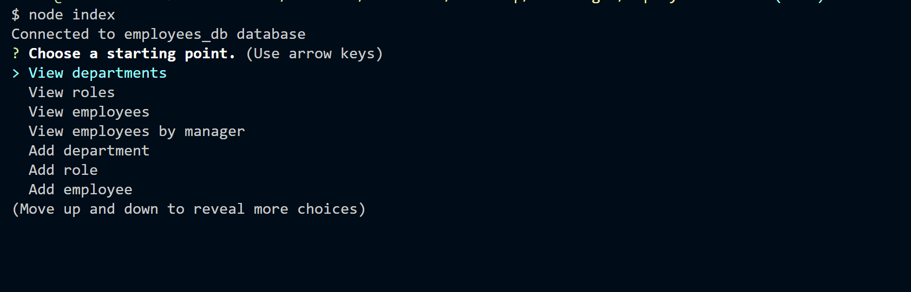

# Employee Tracker

This project contains a simple employee tracker that can be used to organize employees across different departments. 

Employee data is stored in a mySQL databse. CRUD operations can be performed through the prompts to add and update employee information.

Languages/Libraries used:
-
* Node.js
* mySQL
* JavaScript

## Table Of Contents
* [Installation](#Installation)
* [Usage](#Usage)
* [License](#License)
* [Contributing](#Contributing)
* [Tests](#tests)
## Installation

* Clone repo
* run "npm install" in the terminal of your project directory to download dependencies
* See the video below on getting the databse set up
https://drive.google.com/file/d/1tkaV_vkA3Nqv1FxGYI-B7GPiaPvy7DAV/view
    
## Usage/Examples

* Select a task
* Follow prompts to view/manipulate data
* To exit the program, select 'Quit' from the choices list

## License

[MIT](https://choosealicense.com/licenses/mit/)

## Contributing

This project is not currently open for contribution. If you have any questions or concerns, please make a post in the issues section.

## Authors

- [@noothanks](https://www.github.com/noothanks)

## Screenshots

